::: questions 
- Is job wall-time the only way to study job performance?
- What are commonly used metrics and perspectives on job performance?
:::

::: objectives
After completing this episode, participants should be able to …

- Create a comprehensive performance overview through dedicated tools.
- Explain the difference between sampling and tracing.
- Measure utilization and the impact of underlying hardware components.
:::


::: instructor
## Intention: Introduce third party tools for performance reports

Narrative:

- Scaling study, scheduler tools, project proposal is written and handed in
- Maybe I can squeeze out more from my current system by trying to understand better how it behaves
- Another colleague told us about performance measurement tools
- We are learning more about our application
- Aha, there IS room to optimize! Compile with vectorization


What we're doing here:

- Get a complete picture
- Introduce additional metrics / definitions, and popular representations of data, e.g. Roofline
- Relate to hardware on the same level of detail
:::


Wall-time measurements with `time` do not tell us why exactly an application is slower than expected.
To learn more about the *why*, we have to measure our applications behavior in more detail and capture the utilization of underlying hardware.
Broadly categorized, a jobs performance is mostly dependent on

- **CPU utilization**, e.g. how quickly instructions can be send to the processor, how quickly and how much data can be read from memory, and the raw calculation capabilities of the CPU.
- **Memory utilization** may vary in terms of how much data is stored in memory, how often data in memory is written or read, and how quickly the data can be read and written to.
- **Disk input and output** affects jobs that work with amounts of data that exceed available memory capacities.
- **Network input and output** affects applications that rely on remote data, e.g. MPI applications that regularly share results between processes on multiple worker nodes.


{alt='Diagram to visualize the data hierarchy of CPU architectures. Network, local disks, memory, and CPU caches have decreasing amounts of storage capacity, but increasing bandwidths and shorter latencies. Calculations occur in CPUs, possibly in multiple CPU cores, which may have multiple threads each, and even apply vectorized instructions.'}

::: discussion
# Want to share an example?

Every job is limited by a contention point in the hardware.
Resolving one issue, e.g. too slow reading of data from disk, just shifts the contention point to a different location, e.g. waiting for calculations to finish in the CPU cores.
The absolute performance of the application is improved, but it will be always "slowed down" somewhere.

Did you experience a situation, where an application was clearly slowed down in some way?
:::


## Measurement Workflows
To learn how applications utilize the computers hardware, we employ third party tools that read usage metrics from *performance counters*, often implemented either in the operating system kernels (software) or in hardware.

Dedicated performance measurement tools often employ similar methods and rely on the same sources of information, but they my focus on different issues and use different data processing and visualization methods.

In general there are two approaches to performance measurements:

1. **Sampling**: Read out performance counters and the application state at regular intervals during execution
1. **Tracing**: Record every event and operation that occurs

*Tracing* is exact and allows for a very detailed analysis.
On the other hand, it results in very large amounts of measurement data that even affects the applications performance during data collection.
It may be impractical in some situations.

*Sampling* on the other hand is less exact and results in a statistical description of the applications behavior.
Sampling has a smaller *measurement overhead*, but may suffer from, for example, slight mis-attributions of measurements to wrong sections of the code and fluctuating results between repeated measurements.

Measurement results are either stored and analysed in a *timeline*, or aggregated into a final measurement, often called a *profile*.


::: instructor
## Pick and prepare your tool!

We move on with three alternatives here.

1. *ClusterCockpit* is a job monitoring systems that can be configured to capture many performance metrics. It is easy to use, but has to be deployed by the cluster administration team.
1. *Linaro Forge Performance Reports* provides a good first performance overview, but is a commercial application that requires access to valid licenses.
1. *TBD* is a set of open source tools to create a performance overview independent of centralized services and licenses.

Pick one tool and stick to it throughout the rest of the course.
Consider mentioning alternatives and that learners may not have access to certain tools on every cluster, e.g. missing licenses for Linaro Forge.

Be aware of site-specific setups, e.g. limiting access to performance counters, offering non-standard Slurm options during `sbatch` submission, and how licenses are handled.
:::


::: callout
## Pick your tool!
For the following episodes, you can choose between three alternative perspectives on our jobs.
Choose one tool and stick to it for the rest of the course. The alternatives are:

1. [*ClusterCockpit*](https://clustercockpit.org/): A job monitoring service available on many clusters in NRW. Sampled measurements of the application are stored and visualized in a timeline for each job. It needs to be centrally provided by your HPC administration team and may not be available to you!
2. [*Linaro Forge Performance Reports*](https://docs.linaroforge.com/25.0.4/html/forge/performance_reports/index.html): A commercial sampling-based profiler providing a single page performance overview of your job. Access to licenses required.
3. *TBD*: A free, open source tool/set of tools, to get a general performance overview of your job.

These tools may require access to performance counters, sometimes granted by requesting `--exclusive`, but it really depends on the system.
Look at your cluster documentation or talk to your HPC support staff.
:::

::: instructor
## TODO: Discuss requirements in more detail?
```
cap_perfmon,cap_sys_ptrace,cap_syslog=ep
kernel.perf_event_paranoid
```
:::

Let us set up our performance measurement tool by running an example job with 8 cores.
To give the job enough work to be worth measuring, let's go with $2263 \times 2263$ pixels and `-spp=512`.


::: group-tab
### ClusterCockpit

1. Submit a job that runs for at least $5$ minutes, so it is picked up by cluster cockpit. The job script could look like this:
```bash
#!/usr/bin/bash
#SBATCH --time=01:00:00
#SBATCH --ntasks=8
#SBATCH --nodes=1
#SBATCH --mem-per-cpu=1000MB

module load 2025 GCC/13.2.0 OpenMPI/4.1.6 buildenv/default Boost/1.83.0 CMake/3.27.6 libpng/1.6.40

mpirun -- ./build/raytracer -width=2263 -height=2263 -spp=512 -threads=1 -png "$(date +%Y-%m-%d_%H%M%S).png"
```
2. Log in to the ClusterCockpit web interface of your HPC system, as explained in your cluster documentation.
3. Go to `My Jobs` and click on the job with the same Slurm job id, once it is available

{alt='"My Jobs" tab in the ClusterCockpit web UI'}

### Performance Reports

1. Check your cluster documentation and/or module system if the Linaro Forge software suite is available
2. Submit a job loading the Linaro Forge module and start `mpirun` with the `perf-report` application:
```bash
#!/usr/bin/bash
#SBATCH --time=01:00:00
#SBATCH --ntasks=8
#SBATCH --nodes=1
#SBATCH --mem-per-cpu=1000MB

module load 2025 LinaroForge/25.1.1 GCC/13.2.0 OpenMPI/4.1.6 buildenv/default Boost/1.83.0 CMake/3.27.6 libpng/1.6.40

perf-report mpirun -- ./build/raytracer -width=2263 -height=2263 -spp=512 -threads=1 -png "$(date +%Y-%m-%d_%H%M%S).png"
```
3. Performance Report results are created as `.html` and `.txt` files next to the regular Slurm logs.

### TBD

N/A
:::


## General Report

As a first step, to go beyond a wall-time analysis, we employ the measurement tool to produce a general overview of our applications behavior.
Here, we typically try to answer questions like:

- Are available CPU, memory, disk, and network capabilities utilized well?
- Dose the jobs performance depend on a particular hardware component?
- Is there an obvious contention point that could be eliminated?

### First Overview

::: group-tab
### ClusterCockpit

The job view of a particular job in ClusterCockpit begins with three summary panels for the job.

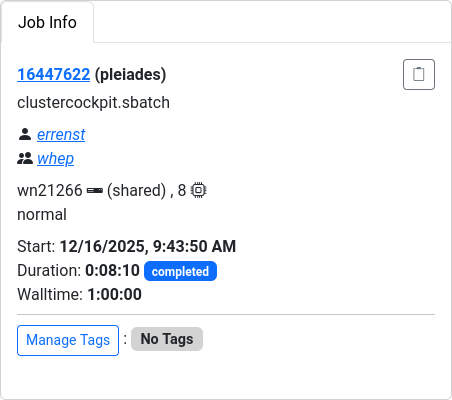{alt='ClusterCockpit Job Info panel'}

The *Job Info* panel summarizes Slurm metadata about the job, e.g. job ID, accounts, start time, duration, etc.

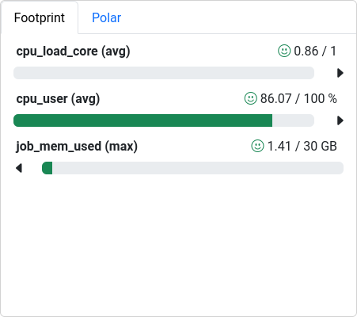{alt='Cluster Cockpit Footprint panel summarizing central job characteristics'}

The *Footprint* panel summarizes a preconfigured set of performance characteristics for the job.
It categorizes values in a traffic-light system, so yellow and red indicators motivates further investigation.
The exact list and type of metrics depends on the ClusterCockpit configuration, which is prepared by the administrator of the service.

Here, all three values are in an acceptable range:

- `cpu_load_core (avg)` is the average load per core. Across all $8$ cores of the job, each one was on average utilized at 86% ($0.86$). The perfect value would be $1$
- `cpu_user (avg)` is the average CPU utilization by user processes (the application), opposed to system activities or even idle cycles
- `job_mem_used (max)` shows the maximum value that has been measured across the jobs duration. With $3.75$ GB available per core on this particular HPC system, the job could have used up to $30$ GB of memory. Any value below that is acceptable, but we could consider lower `--mem` settings in our Slurm job configuration.

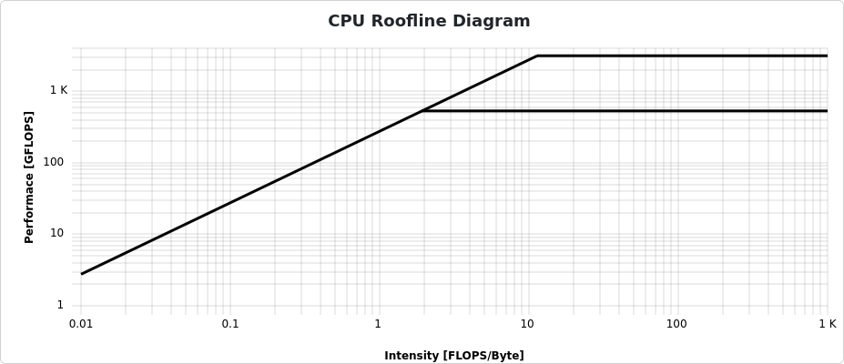{alt='Cluster Cockpit Roofline plot of a job'}

In jobs performing floating point operations on data read from memory, i.e. any numeric operation, which are very common in HPC, a **Roofline plot** is a common visualization of the jobs performance.

On the x-axis, *computational intensity* shows the ratio of floating point operations compared to the loaded data from memory.
The bold diagonal line represents the maximum possible performance limited by the memory bandwidth.
On the other hand, the horizontal lines represent the maximum possible performance limited by the number of possible scalar operations (lower line) and vectorized instructions (upper line).

Many calculations on fewer data result in a large computational intensity (*compute bound*), right of the knee.
Few calculations on more data results in less computational density (*memory bound*), left of the knee.

Color-coded dots show how close the application came to the physical performance limits over the job duration.
There is no data visible for jobs that employ no floating point operations, which unfortunately is the case here. 

{alt='Select Metrics button in the ClusterCockpit job view'}

More detailed plots for each individual metric are available and can be configured through the *Select Metrics* button.


### Performance Reports
Linaro Forge `perf-report` results are stored in a HTML or `.txt` format, for example:

- [Linaro `perf-report` (HTML version)](data/raytracer_8p_1n_2025-12-16_09-53.html)
- [Linaro `perf-report` (txt version)](data/raytracer_8p_1n_2025-12-16_09-53.txt)

The text file is readable from the command line, which is very convenient for quick checks in HPC environments.
The HTML version, however, provides better rendered visualizations and formatting.

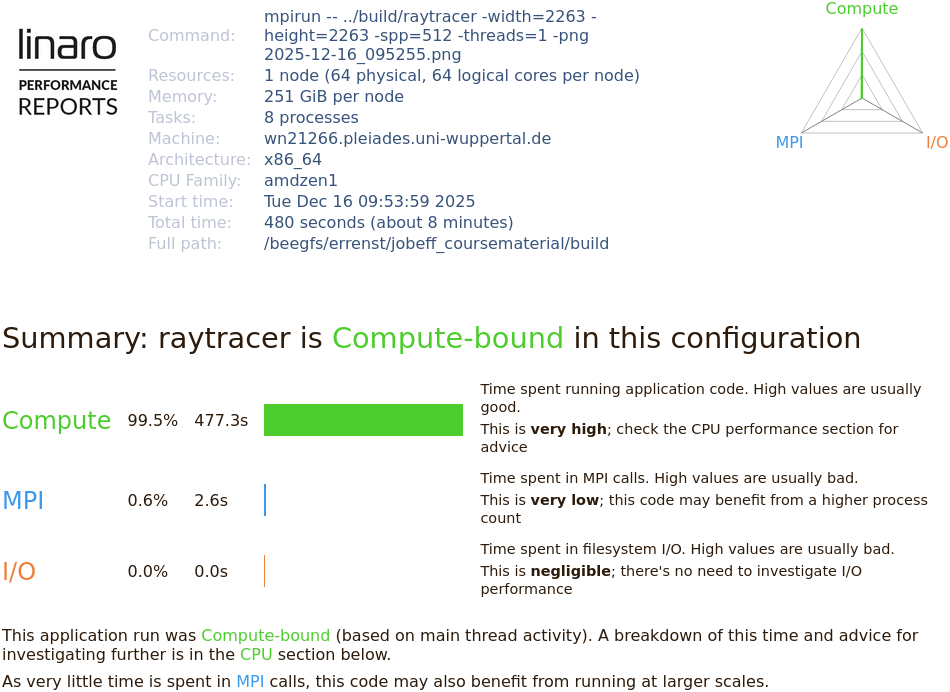{alt='Linaro perf-report overview 1'}

At the top, the Performance Report states metadata about the underlying computer hardware and the application.
The job is summarized in terms of computational intensity, time spent in MPI calls, and impact of disk I/O operations.

The application is automatically classified in these three dimensions and accompanied with suggestions of further investigation.

Here, our application spends 99.5% of the runtime in computations.
Any performance optimization has to focus on improving calculations in the CPU.

### TBD

N/A
:::


### CPU

CPU performance can be categorized in

1. *Front-end* utilization: preparation and scheduling of instructions of program code provided through the cache hierarchy
2. *Computation*: Arithmetic and logical operations with various data types, including the utilization of vectorized instructions, etc.
3. *Back-end* utilization: loading and storing of data in the cache hierarchy

The front- and backend hardware of a physical CPU core is often duplicated to implement *simultaneous multithreading* (SMT, also called hyperthreading).
Here, the arithmetic logical unit receives data and instructions from two independent threads to achieve a sufficient amount, which is a common limiting factor in everyday calculations.
On HPC systems, the benefit of SMT is very much application-dependent.
It is often disabled on HPC systems, since code is optimized to maximize computational intensity.


::: group-tab
### ClusterCockpit
ClusterCockpit captures many dedicated CPU metrics and provides a timeline visualization for each.

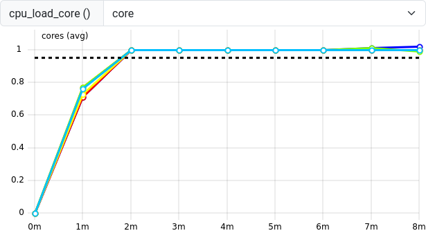{alt='ClusterCockpit cpu load per core'}

The `cpu_load_core` shows the load of each individual core of the job.
The `core` value of the drop down menu indicates a per-core metric.
Other metrics are only available per socket or even per whole node.
These coarser metrics may be affected by multiple jobs on shared nodes, so check the context of each metric you study to make sure that concurrent jobs do not influence your measurements.

Here, the `cpu_load_core` reaches 1 after an initial ramp up phase.
A value of significantly larger than 1 indicates an over-subscription where more processes/threads share the same CPU core.
This can sometimes happen in an erroneous mismatch between OpenMP threads or MPI processes and Slurm tasks or threads per Slurm task.

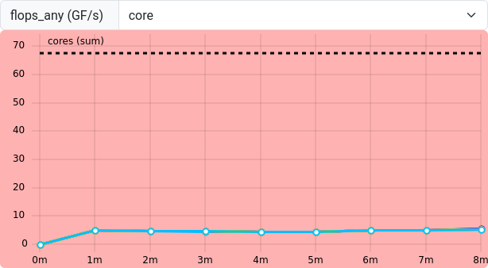{alt='ClusterCockpit flops_any metric'}

`flops_any` shows any floating point operation on AMD CPUs.
Single and double precision operations are accumulated in the same result.
A few FLOPs occur, but the example raytracer application seems to utilize many non-floating point operations.
Therefore, a low `flops_any` is not necessarily critical in this case.

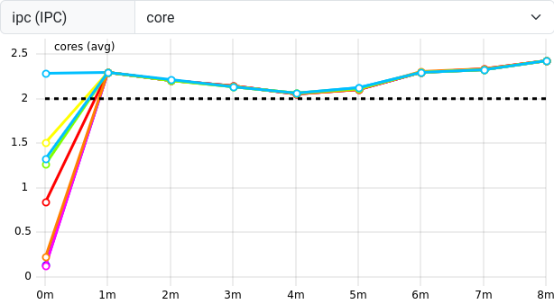{alt=''}

`ipc` (Instructions per Clock cycle) measures the number of operations the CPU is performing on average for each tick of its clock.
CPUs are capable of executing more than one instruction per clock tick, so a value of about $2.25$ indicates that the CPU is "busy enough".

### Performance Reports
Performance Reports summarizes multiple CPU-related measurements.

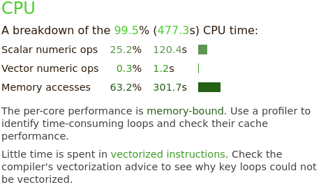{alt=''}

The raytracer spends 99.5% of its time in CPU-related operations.
This breaks down into scalar numeric operations (25.2%) and memory access (63.2%).
It recommends to study the memory access patterns and utilization of vectorized instructions as optimization approaches.

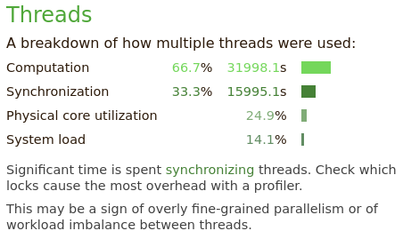{alt=''}

The "Threads" section summarizes threading behavior for multithreaded applications.
A third of the time is spend in thread synchronization operations.

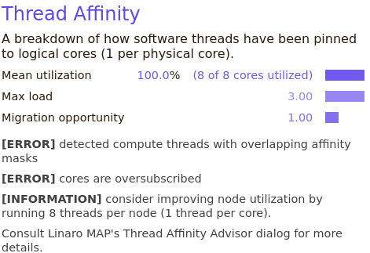{alt=''}

In the "Thread Affinity" section, the applications association between individual threads and processes to specific CPU cores is visualized.
The 8 MPI processes of the example job should be explicitly mapped (pinned) to 8 cores of the job.
Here, the thread affinity is not measured correctly, due to a bug in the underlying software.

### TBD

N/A
:::


### Memory

Memory utilization is characterized in terms of used capacity, bandwidth and access latencies.

::: group-tab
### ClusterCockpit

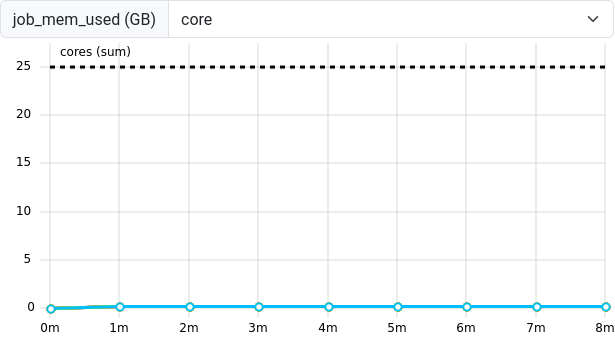{alt=''}

The `job_mem_used` metric measures the memory capacity of a given job at sampled intervals as reported by the Slurm system.
A job is limited to the maximum requested amount of memory and this limit should never be exceeded.
If the application has very short-lived allocations, sharp peaks could fall in between the measured samples and not be captured in this metric.

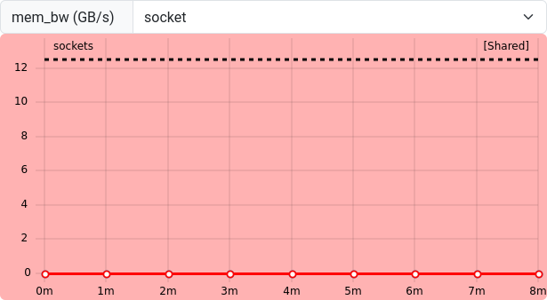{alt=''}

The `mem_bw` metric represents the memory bandwidth at the socket-level of the CPU.
Together with `flops_any`, this information is used to create the roofline plot from the job overview panels.
Our job hardly moves any data to and from memory, which is why the roofline plot has not been populated.

Since this measurement is only available on the socket-level, submit critical measurement jobs with `--exclusive` to not be affected by other jobs on shared worker nodes.

### Performance Reports
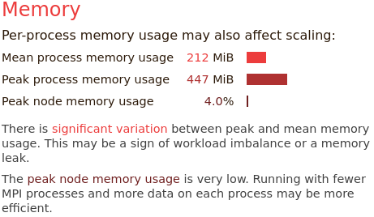{alt=''}

Performance Reports summarizes the memory utilization as a peak and mean measurement for all MPI processes.
Here, the results suggest a possible imbalance between MPI processes, since some have significantly more memory demand than others ($447$ vs. $212$ MiB on average)

If calculations depend directly on the amount of data in memory, then this correlates with unevenly busy MPI processes.

The memory usage over all is very small, so we may be committing too many resources to the amount of calculations in the job.

### TBD
N/A
:::

### Energy
::: group-tab
### ClusterCockpit
{alt=''}

Depending on the ClusterCockpit configuration, an energy demand is displayed below the job info panels.
This measurement is highly dependent on hardware configurations of your HPC systems, so the estimates may vary.
They are often based on CPU packe power measurements, which are unlikely to cover the whole energy demand of the node, e.g. omitting disks, fans, etc.
In other cases, the energy may be estimated from power supply measurements and scaled to CPU activity to get a more accurate estimate.

These estimates often still not include network, parallel filesystem components and cooling of the clusters.
Nevertheless, the estimate is a great tool to identify the scale of the jobs energy demand.

### Performance Reports
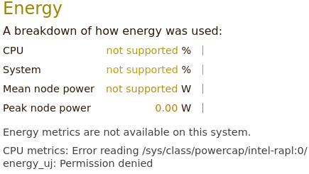{alt=''}

In cases where Performance Reports has user access to energy counters of the operating system, it can also summarize the CPUs and systems energy expenditure.
Here, we are unfortunately missing the required access to the systems "RAPL" interface.

Your HPC system may have a way to enable access to energy counters, e.g. for exclusive jobs.
Consult your clusters documentation or support for more information.

### TBD
N/A
:::


### Miscellaneous
Typically, many more measurements and perspectives on the data are available for each tool.

::: group-tab
### ClusterCockpit
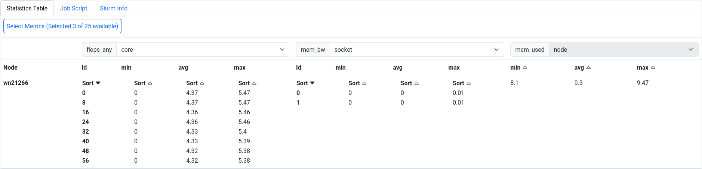{alt=''}

ClusterCockpit provides a detailed statistics table to all measurements involved with a job.

### Performance Reports

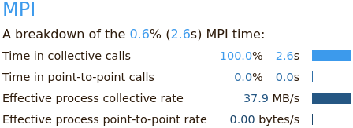{alt=''}
Performance Reports also summarizes the applications behavior in terms of MPI calls, e.g. time spent in collective calls involving all processors, or point-to-point communications.

In larger MPI applications, this can be of great help identify issues in MPI programming.
The example application has mostly independent MPI processes, where only initial data is scattered, and final results are gathered between processes.

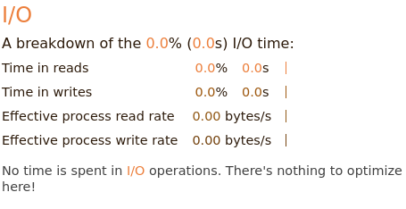{alt=''}
The I/O block summarizes measurements of interactions with the local file systems.
Here, no I/O operations are affecting the applications performance at all.

### TBD
N/A
:::


:::: challenge
## Exercise: Match application behavior to hardware

Which parts of the computer hardware may become a point of contention for these application patterns:

1. Calculating matrix multiplications
2. Reading data from processes on other computers
3. Calling many different functions from many equally likely if/else branches
4. Writing very large files (TB)
5. Comparing strings for matches
6. Constructing a large simulation model
7. Reading thousands of small files for each iteration

Maybe not the best questions, also missing something for accelerators.

::: solution
1. CPU (FLOPS), maybe the cache hierarchy if matrix elements do not align well to cache sizes
2. I/O (network)
3. CPU (Front-End), difficult to prepare instructions in time
4. I/O (disk), bandwidth limited
5. CPU (Back-End), getting strings through the caches
6. Memory (capacity)
7. I/O (disk)
:::
::::


## Summary
Dedicated performance measurement tools are helpful to create reports of the general job behavior.
These tools either trace every event, or sample the application and hardware state at regular intervals.
Many tools are available, but some may have to be set up by the HPC system administrators, or rely on valid licenses.

The relationship between a job and the execution on physical hardware can become a very deep topic.
One of these topics is the correct mapping of job processes to the requested number of CPU cores, addressed in the next episode.

::: keypoints
- Performance tools measure data as regular samples or by tracing every event
- The data is either processed and visualized in a timeline or aggregated in a final profile
- Job performance relates closely to contention points in physical hardware
  - CPU utilization (front-end, ALU, back-end), multithreading, vectorization
  - Memory utilization (capacity, bandwidth, latency)
  - Disk I/O
  - Network I/O

:::
